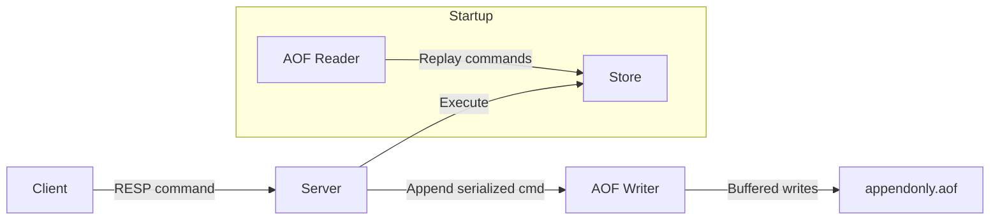

# Redis Clone in Go — Full Implementation Plan

## Project Overview

Build a Redis-compatible in-memory data store in Go that implements the RESP protocol, core commands, expiry semantics, list operations, and AOF persistence. The goal is **depth over breadth** — a tight, correct, well-documented subset of Redis that demonstrates mastery of networking, concurrency, protocol design, and crash-recovery.

> [!IMPORTANT]
> **Anti-goal:** This is NOT a production Redis replacement. The bar is "understood and correctly implemented the hard parts at a reasonable scope." ~10 commands done right beats 50 done wrong.

---

## Project Structure

```
Redis/
├── go.mod
├── go.sum
├── main.go                    # Entry point — starts TCP server
├── README.md                  # Architecture, decisions, benchmarks
│
├── server/
│   └── server.go              # TCP listener, connection handling, event loop
│
├── resp/
│   ├── reader.go              # RESP protocol parser (deserialize)
│   ├── writer.go              # RESP protocol serializer (serialize)
│   └── types.go               # RESP value types (SimpleString, Error, Integer, BulkString, Array)
│
├── command/
│   ├── registry.go            # Command dispatch table (name → handler)
│   ├── ping.go                # PING handler
│   ├── echo.go                # ECHO handler
│   ├── string_cmds.go         # SET, GET, DEL handlers
│   ├── expire_cmds.go         # EXPIRE, TTL handlers
│   └── list_cmds.go           # LPUSH, RPUSH, LRANGE, LPOP, LLEN handlers
│
├── store/
│   ├── store.go               # Thread-safe in-memory KV store interface + implementation
│   ├── entry.go               # Store entry (value + metadata + expiry)
│   └── expiry.go              # Lazy + active expiry logic
│
├── aof/
│   ├── writer.go              # AOF file appender (write-ahead log)
│   └── reader.go              # AOF replay on startup
│
├── config/
│   └── config.go              # Server configuration (port, AOF path, etc.)
│
├── testutil/
│   └── helpers.go             # Shared test utilities
│
└── scripts/
    ├── stress_test.go          # Concurrent load-test client (Stage 5)
    └── benchmark.go            # Custom benchmark harness (Stage 8)
```

---

## Stage 0 — TCP Server Foundation (Day 1)

### Goal
Accept multiple concurrent TCP connections on port `6379`.

### Files to Create

#### [NEW] `go.mod`
- Module: `github.com/sench/redis-clone` (or preferred module path)
- Go version: `1.22+`

#### [NEW] `main.go`
- Parse CLI flags for port (default `6379`)
- Instantiate and start the server
- Handle `SIGINT`/`SIGTERM` for graceful shutdown

#### [NEW] `server/server.go`
- `Server` struct: holds listener, config, store reference
- `ListenAndServe()`: bind `tcp` on `:6379`, accept loop
- Per-connection goroutine: `handleConnection(conn net.Conn)` — for now, read bytes and echo them back
- Proper `defer conn.Close()` and error handling

### Key Decisions
| Decision | Choice | Rationale |
|----------|--------|-----------|
| Goroutine-per-connection vs event loop | Goroutine-per-connection | Go's goroutines are cheap (~2KB stack). Real Redis uses a single-threaded event loop (epoll) because C threads are expensive. In Go, goroutines give us natural concurrency without the complexity of a hand-rolled event loop. The shared store will use `sync.RWMutex` for thread safety. |
| Port configuration | CLI flag with default | Matches real Redis behavior (`--port` flag) |

### Verification
```bash
# Terminal 1
go run main.go

# Terminal 2 & 3 (simultaneous connections)
nc localhost 6379
# Type anything → should echo back
# Both connections work independently
```

---

## Stage 1 — RESP Protocol Parser (Days 2–4)

### Goal
Parse the [RESP (Redis Serialization Protocol)](https://redis.io/docs/reference/protocol-spec/) wire format into structured commands. This is the foundation everything else builds on.

### RESP Wire Format Reference

| Type | Prefix | Example | Go Representation |
|------|--------|---------|-------------------|
| Simple String | `+` | `+OK\r\n` | `Value{Type: SimpleString, Str: "OK"}` |
| Error | `-` | `-ERR unknown\r\n` | `Value{Type: Error, Str: "ERR unknown"}` |
| Integer | `:` | `:1000\r\n` | `Value{Type: Integer, Num: 1000}` |
| Bulk String | `$` | `$5\r\nhello\r\n` | `Value{Type: BulkString, Str: "hello"}` |
| Array | `*` | `*2\r\n$4\r\nECHO\r\n$5\r\nhello\r\n` | `Value{Type: Array, Elems: [...]}` |
| Null Bulk String | `$` | `$-1\r\n` | `Value{Type: Null}` |

> [!NOTE]
> Real `redis-cli` sends commands as RESP Arrays of Bulk Strings. Example: `PING` is sent as `*1\r\n$4\r\nPING\r\n`, NOT as the inline `PING\r\n`. The parser MUST handle the array-of-bulk-strings format to work with `redis-cli`.

### Files to Create

#### [NEW] `resp/types.go`
```go
type ValueType int

const (
    SimpleString ValueType = iota
    Error
    Integer
    BulkString
    Array
    Null
)

type Value struct {
    Type  ValueType
    Str   string    // for SimpleString, Error, BulkString
    Num   int64     // for Integer
    Elems []Value   // for Array
}
```

#### [NEW] `resp/reader.go`
- `Reader` struct wrapping `bufio.Reader`
- `Read() (Value, error)` — dispatches on first byte (`+`, `-`, `:`, `$`, `*`)
- `readSimpleString()`, `readError()`, `readInteger()`, `readBulkString()`, `readArray()`
- Handle `$-1` (null bulk string) and `*-1` (null array)
- Edge cases: empty bulk strings (`$0\r\n\r\n`), empty arrays (`*0\r\n`)

#### [NEW] `resp/writer.go`
- `Writer` struct wrapping `bufio.Writer`
- `Write(v Value) error` — serialize `Value` back to RESP wire format
- Helper constructors: `SimpleStringValue("OK")`, `ErrorValue("ERR ...")`, `IntegerValue(42)`, `BulkStringValue("hello")`, `NullValue()`, `ArrayValue([]Value{...})`

#### [NEW] `resp/reader_test.go`
- Table-driven tests for every RESP type
- Test malformed input (missing `\r\n`, wrong length prefix, negative lengths)
- Test nested arrays

#### [NEW] `resp/writer_test.go`
- Round-trip tests: parse → serialize → parse should yield identical `Value`

### Files to Modify

#### [MODIFY] `server/server.go`
- Replace raw byte reading with `resp.Reader`
- Parse incoming RESP into `Value`, extract command name + args
- Respond to `PING` → `+PONG\r\n`
- Respond to unknown commands → `-ERR unknown command 'xxx'\r\n`

### Verification
```bash
# With redis-cli (the real test)
redis-cli -p 6379 PING
# → PONG

# With nc (inline protocol — optional support)
echo -e "*1\r\n\$4\r\nPING\r\n" | nc localhost 6379
# → +PONG
```

---

## Stage 2 — ECHO and Error Handling (Day 5)

### Goal
Implement `ECHO`, proper argument validation, and the command dispatch architecture.

### Files to Create

#### [NEW] `command/registry.go`
```go
type Handler func(args []resp.Value) resp.Value

type Registry struct {
    commands map[string]Handler
}

func (r *Registry) Register(name string, h Handler)
func (r *Registry) Execute(cmd string, args []resp.Value) resp.Value
```
- Case-insensitive command lookup (store keys as uppercase)
- Return `-ERR unknown command` for unregistered commands

#### [NEW] `command/ping.go`
- No args → `+PONG`
- With arg → bulk string echo of the arg (matches real Redis)

#### [NEW] `command/echo.go`
- Exactly 1 arg required → bulk string response
- Wrong arity → `-ERR wrong number of arguments for 'echo' command`

### Files to Modify

#### [MODIFY] `server/server.go`
- Initialize `Registry` with all registered commands
- Route parsed commands through `Registry.Execute()`

### Verification
```bash
redis-cli -p 6379 ECHO "hello world"
# → "hello world"

redis-cli -p 6379 ECHO
# → (error) ERR wrong number of arguments for 'echo' command

redis-cli -p 6379 FOOBAR
# → (error) ERR unknown command 'FOOBAR'
```

---

## Stage 3 — In-Memory Key-Value Store (Days 6–9)

### Goal
Implement `SET`, `GET`, `DEL` against a shared, thread-safe store. Prove shared state across connections.

### Files to Create

#### [NEW] `store/entry.go`
```go
type Entry struct {
    Value    interface{}  // string for now, will hold lists later
    ExpireAt time.Time    // zero value = no expiry
}

func (e *Entry) IsExpired() bool
```

#### [NEW] `store/store.go`
```go
type Store struct {
    mu   sync.RWMutex
    data map[string]*Entry
}

func NewStore() *Store
func (s *Store) Set(key string, value interface{}, expiry time.Duration)
func (s *Store) Get(key string) (*Entry, bool)  // returns nil for expired keys
func (s *Store) Del(keys ...string) int          // returns count of deleted keys
func (s *Store) Exists(key string) bool
```

- `Get` performs **lazy expiry**: if key exists but is expired, delete it and return `(nil, false)`
- `sync.RWMutex`: `RLock` for `Get`/`Exists`, `Lock` for `Set`/`Del`

#### [NEW] `command/string_cmds.go`
- **SET key value [EX seconds | PX milliseconds]**
  - Parse optional `EX`/`PX` modifiers (prep for Stage 4)
  - Return `+OK`
- **GET key**
  - Key exists → bulk string
  - Key missing → null bulk string (`$-1\r\n`)
- **DEL key [key ...]**
  - Return integer: count of keys actually deleted

### Key Decisions
| Decision | Choice | Rationale |
|----------|--------|-----------|
| `sync.RWMutex` vs `sync.Map` | `RWMutex` | More control, predictable performance, easier to reason about. `sync.Map` is optimized for read-heavy workloads with stable key sets — doesn't match Redis access patterns well. |
| Store value as `interface{}` vs `string` | `interface{}` | Stage 6 adds lists — need polymorphic values. Type-assert at the command handler level. |
| Single global store vs per-db | Single global | Real Redis has 16 databases (`SELECT`), but that's out of scope. One store keeps it simple. |

### Verification
```bash
# Terminal 1
redis-cli -p 6379 SET mykey "hello"
# → OK

# Terminal 2 (different connection!)
redis-cli -p 6379 GET mykey
# → "hello"

# Proves shared state across connections

redis-cli -p 6379 DEL mykey
# → (integer) 1
redis-cli -p 6379 GET mykey
# → (nil)
```

---

## Stage 4 — Key Expiry (Days 10–12)

### Goal
Implement TTL-based key expiration matching real Redis semantics exactly.

### Files to Create

#### [NEW] `store/expiry.go`
- **Lazy expiry** (checked on every `Get`): if `entry.ExpireAt` is non-zero and in the past, delete the key
- **Active expiry** (background goroutine): periodically sample random keys, delete expired ones
  - Real Redis: 20 random keys, 10 times/sec. If >25% expired, repeat immediately
  - Our implementation: simpler — sweep 20 random keys every 100ms

#### [NEW] `command/expire_cmds.go`
- **EXPIRE key seconds** → `:1` if key exists, `:0` if not
- **TTL key** → remaining seconds (integer), `-1` if no expiry, `-2` if key doesn't exist
- **PEXPIRE key milliseconds** → same as EXPIRE but millisecond precision
- **PTTL key** → same as TTL but returns milliseconds

### Files to Modify

#### [MODIFY] `command/string_cmds.go`
- Wire up `SET key value EX seconds` and `SET key value PX milliseconds`
- Parse the optional modifiers after the value argument

#### [MODIFY] `store/store.go`
- `Set()` now accepts optional `time.Duration` for expiry
- `StartActiveExpiry(ctx context.Context)` — launches background goroutine, stoppable via context

### TTL Semantics (must match real Redis exactly)

| Scenario | TTL return | PTTL return |
|----------|-----------|-------------|
| Key exists, no expiry | `-1` | `-1` |
| Key exists, 5.3s remaining | `5` | `5300` |
| Key does not exist | `-2` | `-2` |

### Verification
```bash
redis-cli -p 6379 SET mykey "hello" EX 10
redis-cli -p 6379 TTL mykey
# → (integer) 10 (or 9)

# Wait 11 seconds
redis-cli -p 6379 GET mykey
# → (nil)
redis-cli -p 6379 TTL mykey
# → (integer) -2

redis-cli -p 6379 SET persist "forever"
redis-cli -p 6379 TTL persist
# → (integer) -1
```

---

## Stage 5 — Concurrency Stress Test (Days 13–14)

### Goal
Prove the server handles concurrent access without data races, panics, or lost updates.

### Files to Create

#### [NEW] `scripts/stress_test.go`
A standalone program (not `_test.go` — runs as a main binary) that:
1. Spawns 100 goroutines, each acting as a separate Redis client
2. Each client performs 1000 SET/GET/DEL operations on overlapping keys
3. Validates consistency: a GET after a SET (same client, same key) must return the SET value (unless another client DEL'd it)
4. Reports: total ops, ops/sec, error count, race condition detections
5. Runs with `go run -race scripts/stress_test.go`

### Key Metrics to Capture
- Total operations completed
- Operations per second
- Any panics or race detector violations
- Consistency check failures

### Files to Create

#### [NEW] Makefile (or `justfile`)
```makefile
run:
    go run main.go

test:
    go test ./... -v -race

stress:
    go run -race scripts/stress_test.go

bench:
    go run scripts/benchmark.go
```

### Verification
```bash
# Must pass with zero race detector violations
go run -race scripts/stress_test.go

# All unit tests pass with race detector
go test ./... -race -count=1
```

> [!IMPORTANT]
> **Interview talking point:** Document the concurrency model trade-offs in the README. Real Redis avoids locking entirely via single-threaded execution. Our Go clone uses `sync.RWMutex` — more throughput on reads (parallel), but write contention under heavy load. Discuss when each model wins.

---

## Stage 6 — Lists Data Type (Days 15–19)

### Goal
Add a second data type (lists) to prove the store is polymorphic, not just a string cache.

### Commands to Implement

| Command | Signature | Description |
|---------|-----------|-------------|
| LPUSH | `LPUSH key value [value ...]` | Prepend values to list head. Return new length. |
| RPUSH | `RPUSH key value [value ...]` | Append values to list tail. Return new length. |
| LPOP | `LPOP key` | Remove and return head element. Nil if empty/missing. |
| LRANGE | `LRANGE key start stop` | Return elements in range. Supports negative indices. |
| LLEN | `LLEN key` | Return list length. 0 if key doesn't exist. |

### Files to Create

#### [NEW] `command/list_cmds.go`
- All five commands above
- Type checking: if key exists but holds a string, return `-WRONGTYPE Operation against a key holding the wrong kind of value`
- `LPUSH`/`RPUSH` create the list if key doesn't exist
- `LRANGE` negative index semantics: `-1` = last element, `-2` = second to last, etc.

### Implementation Details

**Underlying data structure:** Go slice (`[]string`)
- `LPUSH`: prepend (O(n) due to slice shift — acceptable for our scope)
- `RPUSH`: append (amortized O(1))
- `LRANGE`: slice indexing with negative index conversion
- For interview discussion: real Redis uses a quicklist (linked list of ziplists). Mention this as a known optimization path.

**Negative index conversion logic:**
```go
func normalizeIndex(index, length int) int {
    if index < 0 {
        index = length + index
    }
    if index < 0 {
        index = 0
    }
    return index
}
```

### Files to Modify

#### [MODIFY] `store/store.go`
- Add `LPush()`, `RPush()`, `LPop()`, `LRange()`, `LLen()` methods
- Type assertions on entry values: `string` vs `[]string`

### Verification
```bash
redis-cli -p 6379 RPUSH mylist "a" "b" "c"
# → (integer) 3

redis-cli -p 6379 LRANGE mylist 0 -1
# → 1) "a"
#    2) "b"
#    3) "c"

redis-cli -p 6379 LPUSH mylist "z"
# → (integer) 4

redis-cli -p 6379 LRANGE mylist 0 -1
# → 1) "z"
#    2) "a"
#    3) "b"
#    4) "c"

redis-cli -p 6379 LPOP mylist
# → "z"

redis-cli -p 6379 LLEN mylist
# → (integer) 3

# WRONGTYPE error
redis-cli -p 6379 SET strkey "hello"
redis-cli -p 6379 LPUSH strkey "world"
# → (error) WRONGTYPE Operation against a key holding the wrong kind of value
```

---

## Stage 7 — AOF Persistence (Days 20–25)

### Goal
Implement Append-Only File persistence: log every write command, replay on startup. Survive `kill -9`.

> [!IMPORTANT]
> **This is the "money demo" for interviews.** The crash-recovery test is the single most impressive thing to show a recruiter: `kill -9` → restart → all data intact.

### Architecture



### Files to Create

#### [NEW] `aof/writer.go`
```go
type AOFWriter struct {
    mu   sync.Mutex
    file *os.File
    buf  *bufio.Writer
}

func NewAOFWriter(path string) (*AOFWriter, error)
func (w *AOFWriter) Append(cmd resp.Value) error  // serialize command to RESP, append to file
func (w *AOFWriter) Sync() error                   // fsync to disk
func (w *AOFWriter) Close() error
```

- **Fsync strategy:** `fsync` after every write (safest, slowest — `appendfsync always` in real Redis). Document this as a trade-off; real Redis defaults to `appendfsync everysec`.
- Use `bufio.Writer` with explicit flush + fsync for performance
- Write the full RESP serialization of each command (array of bulk strings)

#### [NEW] `aof/reader.go`
```go
func ReplayAOF(path string, registry *command.Registry, store *store.Store) error
```
- Open AOF file, create a `resp.Reader` over it
- Read commands one by one, execute them through the same `Registry.Execute()` path
- Skip read-only commands if any accidentally got logged
- Handle truncated/corrupt last entry gracefully (log warning, stop replay — matches Redis behavior)

### Files to Modify

#### [MODIFY] `server/server.go`
- On startup: call `aof.ReplayAOF()` before accepting connections
- After executing a write command: call `aofWriter.Append(originalCommand)`
- Only append write commands: `SET`, `DEL`, `EXPIRE`, `LPUSH`, `RPUSH`, `LPOP`
- Do NOT append read commands: `GET`, `LRANGE`, `TTL`, `PING`, `ECHO`, `LLEN`

#### [MODIFY] `command/registry.go`
- Add `IsWrite bool` flag to command registration
- `Registry.IsWriteCommand(name string) bool`

### AOF File Format
The AOF file is simply concatenated RESP arrays — the exact bytes the client sent for each write command. Example:
```
*3\r\n$3\r\nSET\r\n$5\r\nmykey\r\n$5\r\nhello\r\n
*2\r\n$3\r\nDEL\r\n$5\r\nmykey\r\n
```
This means we can reuse our existing RESP parser to read it back.

### Edge Cases
- **Startup with no AOF file:** Start with empty store (not an error)
- **Truncated last command:** Skip it, log warning. This matches Redis `aof-load-truncated yes` behavior
- **Expiry replay:** Commands with `EX`/`PX` are replayed with the *original* expiry, which means keys that would have expired during downtime will expire almost immediately after replay via lazy expiry. This is acceptable for our scope. Real Redis stores absolute timestamps in the AOF rewrite.

### Verification — The Money Demo
```bash
# 1. Start server
go run main.go

# 2. Write data
redis-cli -p 6379 SET name "Redis Clone"
redis-cli -p 6379 RPUSH colors "red" "green" "blue"

# 3. Hard kill (NOT graceful shutdown)
kill -9 $(pgrep -f "go run main.go")
# On Windows: Stop-Process -Name "main" -Force

# 4. Restart
go run main.go

# 5. Verify data survived
redis-cli -p 6379 GET name
# → "Redis Clone"
redis-cli -p 6379 LRANGE colors 0 -1
# → 1) "red"
#    2) "green"
#    3) "blue"
```

---

## Stage 8 — Benchmarking & Polish (Days 26–28)

### Goal
Quantify performance, write comprehensive documentation, clean up.

### Files to Create

#### [NEW] `scripts/benchmark.go`
Custom benchmark measuring:
- **SET ops/sec** (1 client, 10 clients, 50 clients, 100 clients)
- **GET ops/sec** (same breakdowns)
- **Mixed workload** (80% GET, 20% SET — typical read-heavy pattern)
- **Latency percentiles** (p50, p95, p99)
- Output results as a formatted table

Can also use `redis-benchmark` (ships with Redis) for comparison:
```bash
redis-benchmark -p 6379 -t set,get -n 100000 -c 50
```

#### [NEW] `README.md`
Structure:
1. **What is this** — one-paragraph description
2. **Architecture diagram** (Mermaid) — components and data flow
3. **Supported commands** — table with command, syntax, description
4. **Design decisions** — concurrency model, persistence trade-offs, data structure choices
5. **How to run** — build, run, connect
6. **Crash recovery demo** — step-by-step AOF demo
7. **Benchmarks** — ops/sec table, comparison notes
8. **Known limitations** — what's intentionally out of scope
9. **What I'd add for production** — replication, clustering, RDB, Lua, blocking commands

### Polish Checklist
- [ ] All exported types/functions have godoc comments
- [ ] `go vet ./...` passes
- [ ] `golint ./...` or `golangci-lint run` passes
- [ ] `go test ./... -race` passes
- [ ] Consistent error messages matching Redis format
- [ ] Clean git history (squash fixup commits)
- [ ] No hardcoded paths or magic numbers

---

## Stretch Goals (Pick at most ONE)

> [!WARNING]
> Only attempt these if Stages 0–8 are **completely done and polished**. A half-finished stretch goal is worse than no stretch goal.

### Option A: RDB Snapshotting
- Point-in-time binary dump of entire store to disk
- `BGSAVE` command: fork a goroutine, serialize store to `.rdb` file
- On startup: load RDB if present, then replay AOF on top
- Complexity: medium. Needs a consistent snapshot (copy-on-write or full lock)

### Option B: Pub/Sub
- `SUBSCRIBE channel`, `PUBLISH channel message`, `UNSUBSCRIBE`
- Requires per-connection state (subscription list) and a fan-out mechanism
- Complexity: medium. Good for demonstrating Go channels

### Option C: Basic Replication (Leader → Follower)
- One server is leader, others connect as followers
- Leader sends write commands to followers in real-time
- `REPLICAOF host port` command
- Complexity: high. But highest interview impact — demonstrates distributed systems thinking
- Would need: replication handshake, backlog buffer, connection management

---

## Testing Strategy

### Unit Tests (per package)
| Package | What to test |
|---------|-------------|
| `resp/` | Parse every RESP type, round-trip serialization, malformed input handling |
| `store/` | Set/Get/Del, expiry behavior, list operations, type checking |
| `command/` | Argument validation, error messages, edge cases |
| `aof/` | Write + replay cycle, truncated file handling, empty file |

### Integration Tests
- Start server in test, connect via real TCP, send RESP commands, verify responses
- Multi-client tests: verify shared state across connections
- AOF test: write data → kill server → restart → verify data

### Race Detection
- **All tests run with `-race` flag** in CI and locally
- Stress test specifically designed to trigger races

---

## Interview Preparation Notes

### Framing
> "I built a Redis clone in Go to deeply understand networking, concurrency, and persistence — the fundamentals behind the tools I use daily. It's not meant to replace Redis; it's meant to prove I understand *why* Redis works the way it does."

### Key talking points
1. **RESP protocol** — "I implemented the full wire protocol from the RFC spec. Any real `redis-cli` can connect to my server."
2. **Concurrency model** — "Real Redis is single-threaded to avoid locking. I chose goroutine-per-connection with `sync.RWMutex` because Go's runtime makes this natural. I can discuss the trade-offs: my approach gets better read throughput but has write contention; Redis's approach has zero contention but one slow command blocks everyone."
3. **AOF crash recovery** — "I can `kill -9` the process and restart with zero data loss. Here's a demo." *(This is your mic-drop moment.)*
4. **Lazy vs active expiry** — "I implemented both. Lazy catches expired keys on access. Active expiry runs a background sampler so memory doesn't leak from untouched expired keys."

### "What would you add for production?"
- Clustering (hash slots, resharding)
- Replication (leader-follower with backlog)
- RDB snapshots (point-in-time recovery)
- Lua scripting (`EVAL`)
- Blocking commands (`BLPOP`, `BRPOP`)
- Memory limits and eviction policies (LRU, LFU)
- TLS support
- ACL (access control lists)

---

## Timeline Summary

| Stage | Days | Deliverable |
|-------|------|-------------|
| 0 — TCP Server | 1 | Multi-client TCP server |
| 1 — RESP Parser | 2–4 | Full RESP protocol support, `PING` works with `redis-cli` |
| 2 — ECHO + Errors | 5 | Command dispatch, argument validation |
| 3 — KV Store | 6–9 | `SET`, `GET`, `DEL` with shared state |
| 4 — Expiry | 10–12 | `EXPIRE`, `TTL`, lazy + active expiry |
| 5 — Stress Test | 13–14 | 100-client concurrent load test, zero races |
| 6 — Lists | 15–19 | `LPUSH`, `RPUSH`, `LRANGE`, `LPOP`, `LLEN` |
| 7 — AOF | 20–25 | Crash-recovery persistence |
| 8 — Polish | 26–28 | Benchmarks, README, clean code |

---

## Open Questions

> [!IMPORTANT]
> Please confirm these before I start building:

1. **Module path:** Should the Go module be `github.com/<your-username>/redis-clone` or something else?
2. **Go version:** Is Go 1.22+ installed, or should I target an older version?
3. **AOF fsync policy:** Start with `fsync` on every write (safest) and document the trade-off, or start with `everysec` (faster)?
4. **Should I scaffold the entire project now**, or build stage-by-stage with you reviewing each stage before moving to the next?
5. **Stretch goal preference:** If time permits, which appeals most — RDB snapshotting, Pub/Sub, or replication?
